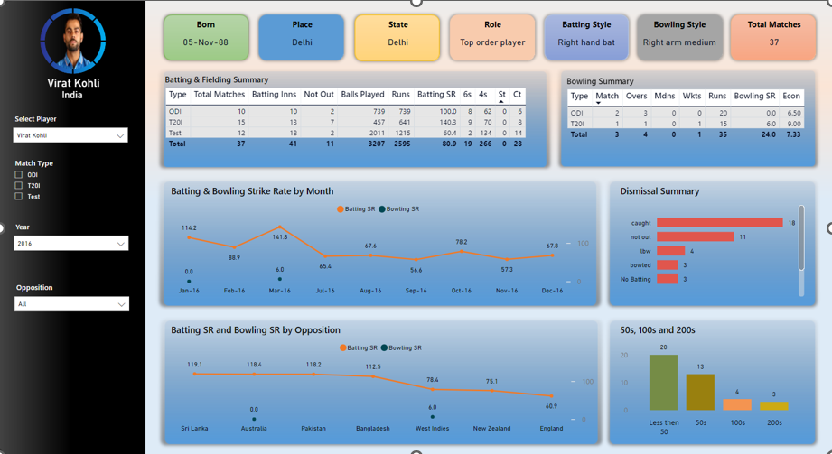
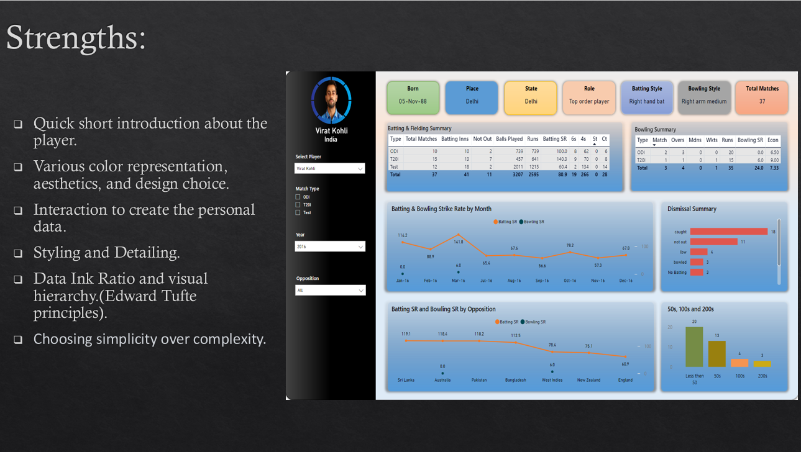
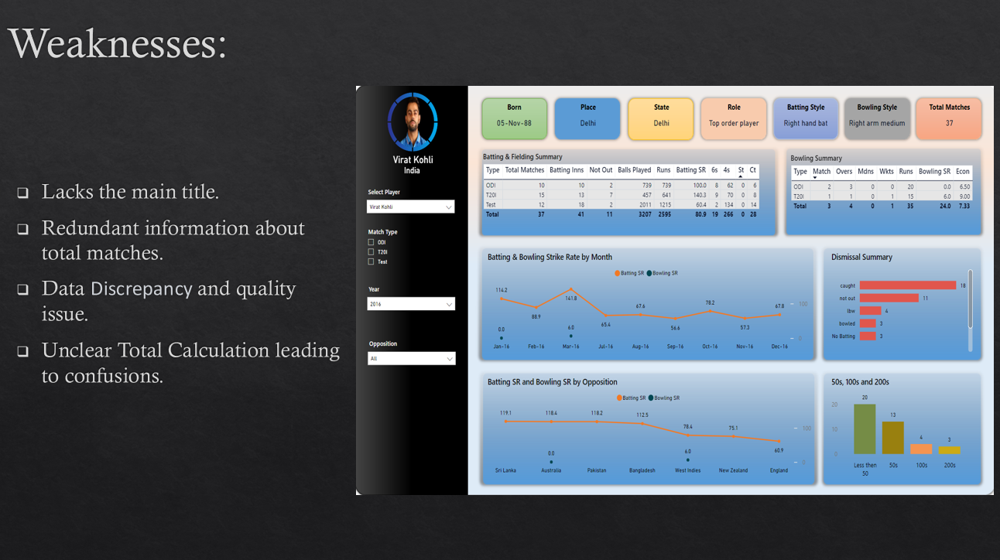

# Data Visualization Critique Project - Virat Kohli's 2016 Performance

**Coursework**: BEMM461  
**Student**: Vaibhavi Ramesh  
**Student ID**: 730074762  

## Project Overview
This project is a detailed critique and analysis of a data visualization that showcases the 2016 cricket performance of Virat Kohli, one of the sport's most celebrated players. This critique, supported by principles of data storytelling and visualization best practices, examines the visualization’s strengths, weaknesses, and offers recommendations for improvement. By dissecting each component, this project emphasizes how well-designed visualizations can transform raw data into engaging stories that inform and inspire audiences.

## Contents
1. [Background](#background)
2. [Context of the Visualization](#context-of-the-visualization)
3. [Key Insights from the Visualization](#key-insights-from-the-visualization)
4. [General Characteristics](#general-characteristics)
5. [Strengths of the Visualization](#strengths-of-the-visualization)
6. [Weaknesses of the Visualization](#weaknesses-of-the-visualization)
7. [Recommendations for Improvement](#recommendations-for-improvement)
8. [Conclusion](#conclusion)
9. [References](#references)

---

## Background
The primary objective of this project is to perform a structured critique on a sports data visualization. This specific visualization, sourced from Microsoft Fabric Community, aims to capture key performance metrics of Virat Kohli’s cricket career in 2016 across multiple match formats: ODIs, T20s, and Test matches.

- **Target Audience**: Cricket fans, data enthusiasts, analysts, and casual followers of the sport.
- **Purpose**: To critically assess the visualization’s components, focusing on its effectiveness in communicating statistical insights through visual representation.
- **Personal Motivation**: My passion for cricket and admiration for Virat Kohli’s achievements motivated me to choose this particular dataset, as it provides an excellent case study of how data visualization can bring sporting statistics to life.

## Context of the Visualization
The visualization captures various aspects of Kohli's career in 2016, including:

- **Batting and Bowling Summary**: Summarizes his performances in terms of runs, balls faced, and dismissals across formats.
- **Milestones**: Highlights significant achievements such as centuries and double centuries.
- **Interactive Elements**: Users can filter the data by match type, year, and opposition to tailor the view to their interests.

This multi-faceted visualization allows cricket enthusiasts to delve into Kohli’s consistency, strengths, and trends throughout the year, offering valuable insights into his performance against different teams.

## Key Insights from the Visualization

### Batting and Bowling Performance
The visualization reveals Kohli's dominance in the Test format, where he batted in 18 innings over 12 matches. His consistently high batting average, exceeding 50 runs throughout the year, speaks to his reliability as a batsman.
In terms of bowling, his participation was limited to ODI and T20 formats, where he bowled occasionally but didn’t make a significant impact compared to his batting achievements.

### Trends and Patterns
- **Strike Rate by Month and Opposition**: The line charts display Kohli’s batting strike rate over time, showing stability and resilience. His performance against specific opponents like Australia and Sri Lanka remains consistently strong, providing a nuanced view of his adaptability.
- **Dismissal Patterns**: An analysis of the dismissal summary reveals that Kohli was most frequently dismissed by being caught, which can serve as valuable insight for opposition teams in strategizing against him.

### Achievements
In 2016, Kohli scored 4 centuries and 3 double centuries, underlining his prowess and ability to anchor innings for the team.

## General Characteristics
The visualization falls under **Everyday Data Visualization**, as classified by Berinato’s framework. This category prioritizes accessibility and straightforward presentation over experimental or highly conceptual visuals. It serves as a **data-driven, declarative visualization** that caters to a broad audience with varying levels of familiarity with cricket.

- **Narrative Style**: The visualization employs an author-reader-driven narrative, where the core information is defined by the author but the interactive features allow readers to explore specific details.
- **System 2 Thinking**: As per Daniel Kahneman's *Thinking, Fast and Slow*, the visualization promotes analytical, System 2 thinking, encouraging viewers to process the data logically and statistically.

## Strengths of the Visualization

1. **Concise Introduction**: The initial section of the visualization introduces Kohli with key details such as his birthplace, role, and playing style. This context is invaluable for viewers unfamiliar with the player, establishing relevance and enhancing engagement.

2. **Color and Aesthetics**: The design uses distinct colors to differentiate between batting and bowling statistics, enhancing readability and keeping the viewer focused. Each data section is clearly segmented with color-coded boxes at the top, ensuring a cohesive layout that doesn’t overwhelm.

3. **Interactivity**: A significant strength of this visualization is its interactive features. Users can filter data based on specific parameters (year, opposition, match type), which dynamically adjusts the charts and tables. This functionality personalizes the experience and allows users to explore data points of particular interest.

4. **Data-Ink Ratio**: Following Edward Tufte's principles, the visualization maintains an effective data-ink ratio, minimizing decorative elements and emphasizing key data points.

5. **Minimalistic Approach**: The visualization opts for simplicity, choosing easy-to-read charts and graphs that prioritize data clarity over complexity. This choice ensures that even a casual viewer can quickly grasp the insights.

## Weaknesses of the Visualization

1. **Absence of a Main Title**: While each individual chart has its title, the overall visualization lacks a main title that encapsulates the theme, which can make it challenging for viewers to understand the purpose immediately.

2. **Redundancy**: Some information, like the total number of matches, is repeated across sections, which could have been streamlined to avoid clutter and improve space utilization.

3. **Data Discrepancies**: There are inconsistencies between different parts of the visualization. For example, Kohli’s total innings in the batting summary do not match the breakdown in the bar chart, leading to confusion and raising questions about data quality.

4. **Unexplained Calculations**: Certain values, like the bowling strike rate, lack explanation. For instance, the ODI strike rate shows 0.2, and T20 shows 6.2, but the total is displayed as 24.2 without any clarification, which could mislead viewers unfamiliar with cricket metrics.

## Recommendations for Improvement

1. **Add a Main Title**: Including a main title would give viewers immediate context and enhance the coherence of the visualization as a single narrative.

2. **Clarify Calculations**: To improve transparency, add explanations or tooltips that detail how specific values are calculated, especially for aggregated metrics like the total strike rate.

3. **Data Accuracy**: Ensuring data consistency across all sections is crucial. The mismatch in the batting innings data should be corrected to maintain accuracy and avoid confusion.

4. **Reduce Redundancy**: Remove repetitive information, such as the total number of matches in both the introduction and the summary. This will create a cleaner, more concise visualization.

## Conclusion
In summary, this data visualization offers a comprehensive overview of Virat Kohli’s cricket performance in 2016, making it accessible and engaging for a broad audience. While the visualization does an excellent job of presenting data through interactive elements and clean design, addressing its weaknesses—such as improving clarity, consistency, and calculation transparency—would elevate its impact and reliability.

This project highlights the importance of designing visualizations that are not only visually appealing but also accurate, informative, and easy to interpret, demonstrating how effective storytelling can amplify data's value.

## References
- Kahneman, D. (2013). *Thinking, Fast and Slow.*
- Tufte, E. R. *The Visual Display of Quantitative Information.*
